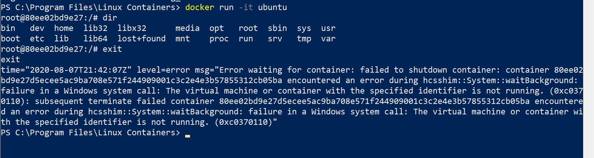
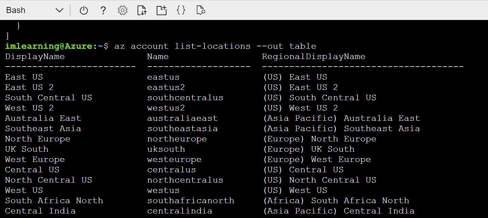
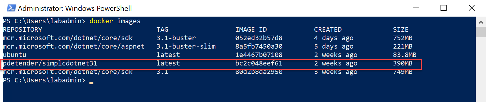
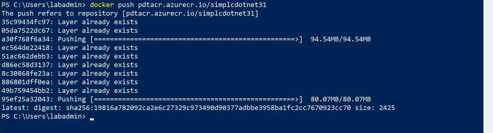

# Festive Tech Calendar 2020 - Hands-On Labs - Running Azure Container Services

How how how!! Welcome to another Festive Tech Calendar event! In this month of learning, why not picking up some skills around Azure and how it allows you to host containerized applications?

While this specific Hands-On Labs is and end-to-end complete exercise, know there is a lot more to migrating your (often legacy) applications to Azure, by using containers. This lab is a **FREE EXTRACT** of my recently published "Migrating a two-tier application to Azure using different platform capabilities" book by Apress

https://www.apress.com/gp/book/9781484264362

   

## What you will learn

In this lab, we focus on deploying (a trial) edition of Docker Enterprise on
Windows Server 2019, but using the LinuxKit rather than using Windows containers
(just because we can and it is cool to showcase the mixed environment setup in
my opinion). Starting with installing the Docker Enterprise Edition for Windows
Server, you learn the basics of Docker commands using the Docker Command Line
interface. Next, students learn how to ‘Dockerize’ the dotnetcore code that has
been used in former lab, using Visual Studio Code with Docker extensions.

In the next task, you learn about Azure Container Registry (ACR) and how to
publish your new Docker container in there, as well as using this as a source
for Azure Container Instance (ACI) and running your web application. We will
also touch on deploying and running Azure WebApps for Containers, allowing for
advanced operations on containerized workloads, compared to Azure Container
Instance.

## Time Estimate

This lab duration is estimated 90 min.

## Tasks:

Task 1: Installing Docker Enterprise Edition on Windows Server 2019

Task 2: Validating and running basic docker commands and containers

Task 3: Integrating Docker extension in Visual Studio Code

Task 4: Deploying and Operating Azure Container Registry

Task 5: Deploying and Running Azure Container Instance

Task 6: Deploying and Operating Azure WebApps for Containers

## Task 1: Installing Docker Enterprise Edition (trial) for Windows Server 2019 on the lab-jumpVM

1.  If not logged on anymore to the lab-jumpVM, open an RDP session to this
    Virtual Machine, using labadmin / L\@BadminPa55w.rd as credentials.  
    

2.  From the **Start menu**, **launch “PowerShell** with **Run as administrator
    permissions**  
      
    

    

3.  **Run** the following **cmdlet:**  
      
    **Install-WindowsFeature -Name Hyper-V -IncludeManagementTools -Restart**  
      
    

    

4.  **Status information** will be shown  
      
    

    

5.  After which the **installation** starts  
      
    

    

6.  Once the installation is complete, your **machine will restart
    (required!!)**; wait for it to reboot, and **log on using RDP again**,
    **re-opening the PowerShell console (Runas administrator)**

7.  Next, we will install the **Docker Enterprise Edition** using the
    **PowerShell module “DockerMSFTProvider”**, using the following **cmdlet**:  
      
    **Install-module “DockerMSFTProvider” -Force**  
      
    

    

8.  Followed by an update-cmdlet to make sure we have the latest bits:  
      
    **update-module “DockerMSFTProvider”**  
      
    

    

9.  **Next,** we will trigger the actual **Docker Enterprise Package**
    installation, **executing the following cmdlet:**  
      
    **Install-package Docker -ProviderName “DockerMSFTProvider” -Update -Force**  
      
    

    

10. Once the installation of the package is complete, we also need to make sure
    we install the Windows Feature **Containers**, informing the host it will
    run as a container host, by **running the following cmdlet:**  
      
    **Install-WindowsFeature Containers**  
      
    

    

11. This was about it from a Windows Server and Module perspective. However, we
    need to go through a few more steps to “enable” the **Linux / Linux
    Containers on Windows – LCOW**, starting with **creating a config json file
    for the experimental aspect** of LCOW.  
      
    **Run the following cmdlet (=1 line, but wrapped because of the layout):**  
      
    **Set-Content -Value "\`{\`"experimental\`":true\`}" -Path
    C:\\ProgramData\\docker\\config\\daemon.json**  
      
    

    

12. **Followed** by **restarting the Docker service**, using  
      
    **restart-service Docker**  
    

13. **Confirm** the Docker engine is up-and-running, by **executing:**  
      
    **Docker version**  
    

14. As well as **executing**:  
      
    **Docker info**  
      
    

    

15. The **Linux Containers On Windows** expects a specific folder to run in, so
    we need to create this folder first; easiest is using **mkdir \<path\>**:  
      
    **mkdir “C:\\Program Files\\Linux Containers”**  
      
    

    

16. **Followed** by downloading the “release” version of the kernel, by
    **launching the following cmdlet:**  
      
    **curl -OutFile release.zip**
    https://github.com/linuxkit/lcow/releases/download/v4.14.35-v0.3.9/release.zip  
      
    

    

17. **Wait** for the download to complete; after which we need to expand the
    archive file, **running the following cmdlet:**  
      
    **Expand-Archive -DestinationPath . .\\release.zip**  
      
      
    

    

18. This **completes** the installation of the **LCOW** component; I’m pretty
    sure this process will become more straight forward in later builds of
    Windows Server 2019, although it is actually not too hard already.

This completes the first task, in which you installed Docker Enterprise Edition
on Windows Server 2019, using the Linux Containers on Windows (LCOW) Kit. In the
next task, you learn several Docker commands for managing and running container
workloads.

## Task 2: Validating and running basic docker commands and containers 

1.  Let’s try and **run a test Linux container, by executing the following
    command:**  
      
    **docker run -it ubuntu**  
      
    

    

2.  Since we don’t have the image on our local machine yet, it needs to be
    downloaded first; the Docker engine relies on the Docker Hub, a public (and
    private) repository of images to pull the image from.  
    

3.  Once the download is complete, **Docker will “start up” the Ubuntu image,
    and run it. This is expressed by giving us access to the Ubuntu system
    prompt (root\@\<containerID\>\#**  
      
    From here, we can perform some basic Linux commands, for example **“LS”**,
    which means “list”, showing a list of folders  
      
    

    

4.  Or running the command “**TOP”**, will show the list of running system
    processes and their performance counters.  
      
    

    

5.  To close the performance view, **press Ctrl-C**, which brings you back to
    the system prompt. If you want to shutdown the container (=leaving the
    runtime), **type “exit”**.  
      
    

    

      
      
    **Note: I received an error message here on screen, informing me about
    “failed to shutdown container”; This is presently listed as a known issue on
    the GitHub pages of the LCOW, although it is more of a bug in the status
    reporting, as the running container actually got shutdown correctly.**  
    

6.  **Validate** the running state of a container can be done by using the
    following **Docker command:**  
      
    **Docker ps**  
      
    

    

7.  Showing **no running containers**; however, if you add the **-a** parameter
    to this command, it shows us “**history”** information about containers that
    ran on this host.  
    

    If you want to tests with a few more **Linux based** containers (eg. Java,
    NGINX, Python,...) and several others that are available from
    hub.docker.com, feel free to do so.

    Remember we have our own **DotnetCore 3.1 sample container**, based on the
    webshop application we used in the previous labs. To speed up the lab, as
    well as keeping the focus on running workloads on Azure, I am storing an
    up-to-date copy of the containerized application in my docker hub as well;
    so why not continuing with this one from here? As well as for all remaining
    container-oriented lab exercises?

8.  The Simplcommerce webshop container image in hub.docker.com is
    **pdetender/simplcdotnet31**, so similar to the ‘docker run ubuntu’ example
    earlier, you can execute this command:  
      
    **docker run -it -p 5000:80 pdetender/simplcdotnet31**  
      
    **some explanation for the parameters:**  
    **-it run container in interactive mode, which means it will show output (if
    any) in the console window**  
    **-p 5000:80 this defines the container running on port 80, but mapping this
    to port 8000 in our local browser; this is handy when we have other
    applications or containers already running on port 80, and as such avoiding
    any conflicts**  
      
    

    

      
      
    

9.  Once the container is downloaded and running, **open “localhost:5000”** in
    your browser, which will show the “home page” of the Simplcommerce web
    application. Instead of expecting a full database like we used the Azure SQL
    earlier, this sample container image comes with its own built-in database
    engine. (if we want, we could update the container variables and actually
    point to an external database)  
      
    **Select “Phones”** and **click the “Do it!”** button to confirm  
      
    

    

10. The webshop opens and shows **devices** available for buying  
      
    

    

11. **While this container instance is running**, why not **starting another
    one**?  
    

12. **Launch an additional instance of the PowerShell Console (Runas
    Administrator)**, and **start a new container instance:**  
      
    **docker run -it -p 4000:80 pdetender/simplcdotnet31**  
    

13. this time running on port 4000... **since the image is already downloaded**,
    the container instance will kick-off immediately  
      
    

    

      
      
    

14. **Open your browser**, and connect to **localhost:4000**, which will show
    the webshop home page. Confirming this is a new instance, since it is asking
    again to select the product database we want to use this time.  
      
    

    

      
      
    

15. Which loads the full application once selected.  
      
    

    

16. **Switch back** to the **PowerShell window** (either of the open ones), and
    run  
      
    **docker images**  
      
    

    

      
      
    showing a list of all current docker images available on our machine. Note
    that besides the ubuntu and simplcdotnet31 one, I had a few additional ones
    but you won’t necessarily have these)  
    

17. **Once more**, validate the “running” state of your container instance from
    a “docker perspective”, but initiating the following command:  
      
    **docker container ls**  
      
    

    

18. As you (should) still have the container instances running (port 4000 and
    port 5000), you **can take note of the (unique instance) container ID**, and
    reuse this in other docker commands, like for example:  
      
    **docker inspect 82d44** (where these are the first few characters of the
    container ID)  
      
    **Providing a lot of additional details about our running container
    instance:**  
      
    

    

      
      
    

19. **For example “LogPath”**  
      
    

    

20. Which points to a JSON-log file, viewable from Windows Explorer, when
    browsing to the file location:  
      
    

    

21. **Open the log-JSON file**, and notice the information stored in here, is
    the same as wat you saw earlier in the running container console (because
    you specified the “-it” parameter). Good to know this is not really required
    (although I personally prefer it, as it is a useful and easy mechanism to
    validate your container workload is running fine)  
      
    

    

This completes the 2nd task, in which you learned several Docker commands,
allowing you to run, validate and troubleshoot containerized application
instances. In the next task, I will show you another way to manage containers,
using Visual Studio Code – Docker extensions.

## Task 3: Integrating Docker extension in Visual Studio Code

1.  From the **Start menu**, **launch “Visual Studio Code”**  
      
    

    

2.  From the **Extensions** option, **search for “Docker”**  
      
    

    

3.  **Press the** “**Install”** button; while not (always) needed, I typically
    advise to **restart Visual Studio Code** after the installation,
    guaranteeing it loads successfully. This helped me tremendously in
    troubleshooting, or avoiding to needing to do that 😊.  
    

4.  **Notice** the **Docker extension** installed successfully, by **clicking on
    the Docker icon**  
      
    

    

5.  From the **left menu, it immediately exposes some information about the
    Docker environment that is running on the Docker Host:**  
      
    **- Containers**  **lists up the running/historic running containers on this
    host**  
    **- Images**  **lists up the container images**  
    **- Registries**  **Private Docker compatible registries e.g. Azure
    Container Registry**  
      
    

6.  **Besides** the information here on the left menu, the extension also comes
    with **command palette options in the “View” menu**  
      
    

    

7.  **From “Command Palette”, start typing “docker”, showing a list of different
    commands available**, similar to the ones you used in PowerShell earlier;
    but now you don’t (always 😊) have to remember them or know the correct
    syntax or parameters, but rather make use of this list.  
      
    

    

8.  Remember the **docker inspect** command; you can run this now from the
    **Docker extension** menu:  
      
    

    

9.  **Providing** a similar **log-JSON** file, but directly published within
    Visual Studio Code  
      
    

    

      
      
    

10. **Or selecting “View Logs”**  
      
    

    

      
      
    

11. **Exposing** the logging information in a Visual Studio terminal window  
      
    

    

12. **There are a lot of interesting actions available from the Docker
    extension, enabling DevOps teams an easy and single tool to manage your
    application workloads, from source code to containers and everything in
    between.**

This completed the task in which I introduced you to the Docker extension in
Visual Studio Code. As you know the basics of operating Docker and containerized
workloads, let’s move on and reuse this knowledge on Azure.

**(PDT – I’m thinking of splitting up this chapter in 2, where the previous part
is covering Docker basics, and the following part is covering Azure Container
Registry and Azure Container Instance and WebApp for Containers; it feels too
long in nature the way it currently is... please advise**

## Task 4: Deploying and Operating Azure Container Registry 

As we have a successfully built Docker container out of the previous task, we
can move on with the next step in the process, and migrating this container to
Azure. Starting from pushing it into Azure Container Registry (ACR), and running
it as a Container Instance (ACI).

1.  **Log on to the Azure Portal**, http://portal.azure.com, with your Azure
    admin credentials. From here, **Open Cloud Shell**  
      
    

    

2.  **Follow** the configuration steps if this is the first time you launched
    Cloud Shell In the Environment, make sure you choose **Bash**.  
      
    

    

    

    the nvironment, make sure you **Bash**.  
      
      
    

    

      
      
    

    

    

3.  Execute the following Azure CLI commands, to **create a new Azure Resource
    Group**:  
      
    az group create --name [SUFFIX]-containersRG --location \<Azure Region Name
    of choice\>  
      
    

    

4.  Followed by another Azure CLI command to **create the Azure Container
    Registry**:  
      
    az acr create --resource-group [Suffix]-containerRG --name [SUFFIX]ACR --sku
    Basic --admin-enabled true  
      
    

    

5.  The next involves connecting to the Azure Container Registry we just
    created, and pushing our Docker image into it. This relies on the following
    command:  
      
    az acr login –name [SUFFIX]ACR –resource-group [SUFFIX]-containerRG  
      
    

    

6.  This means, we have to execute the remaining commands from our local
    lab-jumpVM, instead of the Azure Cloud Shell. Since we preloaded the Azure
    CLI on this machine, we can immediately make use of it (FYI, if you need to
    install this on your local machine when not using the jump-VM, use the
    following link:
    https://docs.microsoft.com/en-us/cli/azure/install-azure-cli-windows?view=azure-cli-latest  
    

7.  To **validate** the Azure CLI is installed fine, **open a new PowerShell
    window,** and initiate the following command:  
      
    az  
      
    

    

8.  This confirms Azure CLI 2.0 is running as expected. We can continue with our
    Azure Container Registry creation process. But first, we need to
    “authenticate” our session to Azure, by running the following command:  
      
    az login  
      
    

    

9.  This opens your internet browser, and prompts for your Azure admin
    credentials:  
      
    

    

10. After successful login, the following information is displayed:  
      
    

    

11. You can close the internet browser.  
    

12. When you go back to the PowerShell window, it will show you the JSON output
    of your Azure subscription, related to this Azure admin user:  
      
    

    

    **Note: If you should have multiple Azure subscriptions linked to the same
    Azure admin credentials, run the following AZ CLI command to guarantee you
    are working in the correct subscription:**  
      
    **az account set --subscription “your subscription name here”**  
      
      
    

13. Let’s try to redo our Azure Container Registry process, by executing the
    following command:  
      
    az acr login –name [SUFFIX]ACR –resource-group [SUFFIX]-containerRG

    

14. **You can also validate the Azure Container Registry from the Azure Portal**  
      
    

    

15. And validate the details of the Azure Container Registry resource  
      
    

    

## Task 5: Deploying and Running Azure Container Instance 

1.  As we now have connectivity towards the ACR, we can push our Docker image to
    it. There is however a dependency that the name of our Docker image needs to
    have the name of the Azure Container Registry in it. So we first need to
    update the Docker image tag for our Docker image, by executing the following
    command:  
      
    docker images (To get the image ID number)  
      
    

    

      
      
    docker tag bc2c [SUFFIX]ACR.azurecr.io/\<nameyouwanttogive\>  
      
    docker images (To validate the “new” image)  
      
    

    

      
      
    **Notice the Image ID is identical, as technically, all we did is creating a
    clone with a new name.**  
    

2.  Execute the following command to upload this image to the Azure Container
    Registry:  
      
    docker push [SUFFIX]ACR.azurecr.io/\<nameyouwanttogive\>  
      
    

    

      
      
    

3.  **Wait for this process to complete successfully; depending on internet
    connection speed, this might take some time.**

    

4.  From the Azure Portal \| All Services \| Azure Container Registries \|
    select the ACR you created earlier.  
      
    

    

      
      
      
    

5.  **Click the** \<yourcontainername\> repository, which opens the specific
    details for this image, exposing its version (we used the default version
    tag “latest”, but this could also be dev, test, v1.1, v2.5,... in a real
    life scenario):  
      
    

    

    This completes this task, in which you created an Azure Container Registry
    (ACR), tagged a Docker container image, and uploaded this to Azure Container
    Registry repositories. In the next task, you will deploy this repository
    into a running state using Azure Container Instance (ACI)  
    

## Task 5: Running an Azure Container Instance from a Docker image in Azure Container Registry 

1.  From the **Azure Container Registry,** browse to repositories, select your
    repository, and click through to “latest”; from here, click the **…** next
    to latest, and **choose Run Instance**  
      
    

    

2.  This **opens the Create Container Instance blade. Complete the parameter
    fields using the following information:**  
      
    **-** Container Name [SUFFIX]simplcdotnet31 (or any other name you like)  
    - OS-type Linux  
    - Subscription your Azure Subscription  
    - Resource Group select [Suffix]-containerRG as Resource Group  
    - Location same location as where you deployed ACR  
      
    Leave all other settings unchanged (1 core, 1,5GB memory, Public IP address
    YES and Port 80)  
      
    

    

      
      
    

3.  Press **OK** to have the Container Instance created. Deployment
    initialization kicks off.  
      
    

    

4.  Follow the details by clicking on the “deployment is underway...” from the
    notifications area  
      
    

    

      
      
    

5.  Wait for the deployment process to complete successfully, which should
    typically be within a minute  
      
    

    

    .  
    

6.  Once the deployment is finished, **Click Go to** resource; or open **the
    Azure Container Instance** in the portal (All Services \| Container
    Instances), and **browse to the ACI “instance”** that just got created.  
      
    

    

7.  **Copy the IP address** for this Azure Container Instance, or directly
    browse to it from your internet browser, which should load your application
    successfully.  
      
    

    

      
      
    There’s the webshop again; similar to the “local” Docker container
    behaviour, it opens the home page, asking for a product offering. While I’m
    not showing the outcome here, you already know how this works.  
      
      
    

8.  Back in the Azure Portal / Azure Container Instance blade, browse to
    **Containers** under **Settings**; Within the **events** tab, this exposes
    more details about the running container itself, as well as providing a view
    on the process of pulling the image and running it:  
      
    

    

9.  **Next, click the Logs tab**, showing you similar output from the log-json
    option you used earlier by executing “docker inspect” from the command line
    or selecting “inspect” from the Docker extension in Visual Studio Code.  
      
    

    

10. **Return** to the **Overview** section of the Azure Container Instance
    blade, and notice the action buttons on top, allowing you to **start,
    restart, stop or delete** the container instance.  
      
    

    

11. **Nice to remember is that you don’t pay anything for a “stopped”
    container**, so it could become in handy to **Stop** the container instance
    for now, saving a few bucks of your monthly Azure bill.  
      
    

    

12. Checking back from the instance Overview tab, notice the Public IP address
    is also “released” from the running instance  
      
    

    

13. **Start** the container instance again, by clicking the Start button; wait a
    few seconds, and check on the updated settings, the container instance got a
    new public IP address  
      
    

    

14. **This** is probably not something you want in a production environment, so
    let’s spin up a new container instance, this time starting from the “+
    Create Resource” , and search for “**Container Instance**”  
      
    

    

15. **Confirm the creation, by clicking the Create button**  
      
    

    

16. **Provide the necessary settings, following below information guideilnes:**  
      
    

    

      
    **- Subscription**  **Your Azure subscription**  
    **- Resource Group [Suffix]-ContainersRG**  
    **- Container name unique name for this container instance**  
    **- Region**  **Same Azure region as Azure Container Registry**  
    **- Image Source**  **Azure Container Registry**  
    **- Registry**  **\<your Azure Container Registry\>**  
    **- Image**  **\<your Azure Container Repository\>**  
    **- Image tag**  **latest**  
    **- OS Type**  **Linux**  
    **- Size**   **1 vcpu, 1,5GiB memory**  
    

17. Where this was similar to the previous way of deploying an Azure Container
    Instance, only driven directly from Azure Container Registry repositories,
    we take it a small step further by going through some additional
    configuration parameters. Continue by **clicking the Next: Networking
    button**  
      
    

    

18. From the **Networking** tab, notice the default **networking type is
    “public”**, allowing a direct connection from the internet to your running
    container instance. Switching this to “**private**” allows you to define
    **what Azure Virtual Network and subnet** you want to deploy this container
    instance into.  
      
    **To see this in action, select the JumpVMVNet;**  
    

    

19. Although the subnet is automatically pulled up from the JumpVMVNet settings,
    **we cannot use this subnet to mix container instances with Virtual
    Machines**. This is also emphasized from this error message (if you try to
    deploy this...)  
      
    

    

20. Instead, **click “Manage subnet configuration**”, which redirects you to the
    Azure VNet and Subnet settings. Here, **Add a subnet**, by clicking the **+
    Subnet** button  
      
    

    

21. From the **Add Subnet** blade, provide the following parameters:  
    **- Name ACISubnet**  
    **- Address Range 10.1.1.0/24**  
      
    Leave all other default settings, and confirm by **clicking OK**.  
      
    

    

22. **Refresh** the list of Subnets; notice the **ACISubnet** will be in the
    list now. Next, click “**Create Container Instance**” from the breadcrumbs
    link in the portal, which brings you back to the Azure Container Instance
    creation wizard  
      
    

    

23. **This time**, select the **ACISubnet** in the network / subnet settings  
      
    

    

24. Move on to the next step in the ACI creation wizard, by **clicking the
    Next:Advanced button**; Here, one can specify when a container should
    restart, where the default is **On Failure**, but could also be **Always**
    or **Never**.  
      
    In the **Environment Variables** section, one could provide specific
    application variables like for example to identify dev/test or production
    settings, database connection strings and alike.  
      
    

    

25. That’s all we need to configure here; continue the deployment by **clicking
    the “Review and Create” button, and confirming “Create” once more by
    clicking the button.** This will kick off the creation of the 2nd Azure
    Container Instance.  
      
    

    

      
    

26. After about a minute, the private Azure Container Instance is ready; nothing
    is really different than before, besides the **IP address is now an internal
    IP range based one**; this would mean the containerized workload is
    reachable from within the JumpVM itself.  
      
    

    

27. (If not already), **open an RDP session** to the **JumpVM server**, and once
    logged on, **connect to the IP address** of this Azure Container Instance
    from your browser.  
      
    

    

28. Nice, achievement unlocked!

**This completes this task, in which you learned about Azure Container Instance
for public internet facing running workloads, as well as internal/private
running once.**

## Task 6: Deploying a Operating Azure Web Apps for Containers

Another method to run containerized workloads in Azure Platform as a Service
outside of Azure Instance, is **Azure WebApps for Containers**. Easy said, it
gives you all (or most...) of the Azure WebApp features, but instead of
publishing source code, you publish and run a Docker container.  

Main differences compared to Azure Container Instance is that it allows for
scalability, supports deployment slots swapping, and is linked to App Service
Plans consumption costs, instead of ACI running costs.  
  
That’s what you will deploy and run in this task.

1.  **From the Azure Portal** \| **Create New Resource** \| **Web App**.  
      
    

    

2.  **Press the Create** button to open the Web App blade. Complete the required
    parameters as follows:  
      
    **- App Name:**  **[SUFFIX]contwebapp.azurewebsites.net**  
    **- Resource Group: [SUFFIX]-ContainerRG**  
    **- OS:**   **Linux**  
    **- Publish:**  **Docker Image**  
    **- Region:**   **Same Region as Azure Container Registry**  
      
    

    

3.  You also need to define the App Service Plan parameters:  
      
    

4.  For the **Service Plan** parameter, **click Create New**  
      
    

    

5.  **Complete** the required parameters for the App Service Plan as follows:  
    - **App Service Plan:** [SUFFIX]contwebappPlan  
    - **Location**: Same Region as Web App  
    - **Pricing Tier:**   Select the Premium V2 P1v2 plan  
      
    

    

6.  And confirm the plan with **OK. Click Next:Docker** to continue the
    configuration steps.  
    

7.  While we could use the same container from Azure Container Registry as in
    the previous task, let’s try something with **Public Docker Hub** this time,
    showing you running Container Instances on Azure (in any supported way)
    doesn’t require Azure Container Registry  
      
    **Complete the following settings and parameters:**  
      
    **- Options**    **Single Container**  
    **- Image Source**    **Docker Hub**  
    **- Access Type**    **Public**  
    **- image**  **and tag**   **pdetender/simplcdotnet31**  
      
    

    

8.  **Confirm the creation** by clicking the **Review and Create** button.  
    

9.  **Press** the **Create** button to start the deployment of the Azure Web App
    for Containers.  
    

10. **Follow-up** on the deployment from the notification area.  
    

11. **Once deployed**, browse to the **[SUFFIX]contwebapp Azure Resource**,
    which opens the detailed blade:  
      
    

    

12. **Click** the URL which opens your default internet browser. The
    containerized webshop workload should be up and running once more 😊

      
      
    

    

13. **Go back** to the Azure Portal, which still has your Azure Web App for
    Containers open; here, **browse** to **Settings \| Container Settings** and
    **look at the LOGs section.** This shows the different steps undergoing to
    get the container running.  
      
    

    

14. For me, this is yet another benefit compared to Azure Container Instance,
    which is not giving you the same level of detail on what’s happening with
    the container during the creation of the webapp itself, or at least not this
    easy.  
    

    This completes this task, in which you got introduced to Azure Web App for
    Containers.

# Summary

In this lab, you learned about installing Docker Enterprise for Windows Server.
Next, you learned the basics of running Linux-based Docker images and
containers, followed by executing several Docker commands that are common when
operating Docker images and containers, as well as how Visual Studio Code
extension for Docker could help you as well.

In the following tasks, you pushed the Docker container to Azure Container
Registry, and deployed a Container Instance running the image. You also learned
how to deploy Azure WebApp for containers and validating each process was
working fine and offering a running e-commerce platform.
